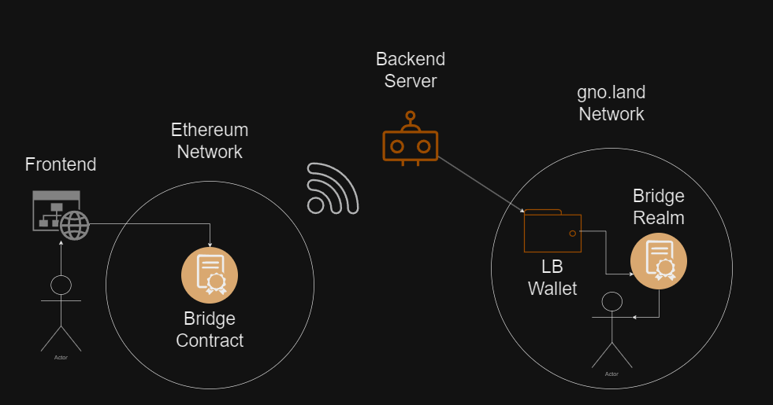

# Bridge Between Ethereum and GnoLand Networks


This project was developed during a Web3 camp with the goal of creating a bridge between the Ethereum and GnoLand networks, enabling the transfer of assets between these two blockchain networks.

## Project overview

The Liberty Bridge is a centralized blockchain bridge that facilitates the transfer of cryptocurrency between the Ethereum (Sepolia) and gno.land networks. The process begins when a user connects their MetaMask wallet to our frontend interface. They then select the type of cryptocurrency they wish to transfer, specify the amount, and provide their address on the destination network before submitting the transaction.

Upon submission, our system invokes the MetaMask API, which transmits the transaction details to our smart contract. The smart contract then executes the transaction and emits an event. Our backend is configured to listen for these events, and upon detection, it processes the information. Using the gno.js library, our backend connects to our wallet on the gno.land network. The system then initiates a call to the Mint function within our Realm, minting new GETH tokens and sending them to the specified address on the gno.land network.



## Future Plans

**Security and Reliability Enhancements:**  
We are committed to bolstering the security of our bridge to ensure safe, reliable transactions, eliminating potential exploits and system vulnerabilities.

**Development of Custom Banker and EGRC20 Token:**  
We are designing a custom banker that supports `uint256`, replacing the current `int64`, to align with Ethereum standards and enhance flexibility. Additionally, we will develop an EGRC20 token with `uint256` support, enabling the handling of larger token amounts and offering improved functionality.

**Bi-Directional Bridge Expansion:**  
We plan to extend the bridge's capabilities to support transactions from gno.land to Ethereum, facilitating seamless, two-way transfers between these platforms.

**Transaction Fee Implementation:**  
To ensure the sustainability of our bridge, we will introduce transaction fees. These fees will be set at a fair and competitive rate, balancing user satisfaction with operational viability.

**Enhanced User Experience:**  
We are dedicated to developing a user interface that is both intuitive and elegant. Our goal is to create a simple, easy-to-navigate frontend that ensures a seamless experience for all users.

**Additional Feature Development:**  
We will continuously explore and implement new features aimed at improving the functionality and overall usability of the bridge.

## Backend Setup

You can use our pre-deployed smart contract on the Ethereum network with the address `0x6F677442B0cb3E80B39090661a427cf1b1fA0c46` for testing. If you prefer to deploy your own contract, follow the steps below:

### 1. Configure the `.env` File

Create a `.env` file in the root directory and set up your environment variables. You can use our example configuration from the `.env.example` file, or if you prefer, you can use our Ethereum smart contract mentioned above.

### 2. Install Node.js Packages

Install the required Node.js packages:

```bash
npm install
```

### 3. Install dotenv

`dotenv` allows you to manage environment variables from the `.env` file:

```bash
npm install dotenv
```

### 4. Install Hardhat

Install Hardhat, a development environment for Ethereum:

```bash
npm install hardhat
```

### **Note:** If you are using our pre-deployed Ethereum smart contract for testing, you can skip steps 5 and 6 below.

### 5. Copy the `Bridge.sol` File (if deploying a new contract)

If you are deploying your own contract, create a folder named `contracts` within the `backend` directory and copy the `Bridge.sol` file into this folder.

### 6. Deploy the ETH Contract

To deploy your own Ethereum smart contract, use the following command:

```bash
npx hardhat run scripts/deploy.ts --network sepolia
```

This will deploy a new smart contract on the Sepolia network. If you prefer not to deploy your own contract, you can use our pre-deployed smart contract on the Ethereum network with the address `0x6F677442B0cb3E80B39090661a427cf1b1fA0c46` for testing.

### 7. Run the Listener Script

Run the listener script on the Sepolia test network:

```bash
npx hardhat run ./scripts/listener.ts --network sepolia
```

## Frontend Setup

### 1. Install Node.js Packages

In the frontend root directory, install the necessary packages:

```bash
npm install
```

### 2. Run the Development Server

Start the development server:

```bash
npm run dev
```

## Contracts Setup

### 1. Deploy Contracts

Deploy two smart contracts: one on the Ethereum network and one on the GnoLand network. If you don't want to deploy your own GnoLand contract, you can use our pre-deployed smart contract with the address `g12x53uevj3plq8fpntp59nr7dvwu3a0gzw74n9f` for testing.

### 2. Check the Balance on the GnoLand Network

If you have deployed your own GnoLand contract, replace the address in the following command with yours. Otherwise, you can use our address:

```bash
gnokey query bank/balances/g12x53uevj3plq8fpntp59nr7dvwu3a0gzw74n9f --remote https://rpc.test4.gno.land:443
```

## Authors

This project was developed by:

- **Dragan Milošević**  
  [GitHub](https://github.com/Milosevic02) | [LinkedIn](https://www.linkedin.com/in/dragan-milosevic3/)

- **Nemanja Matić**  
  [GitHub](https://github.com/Nemanya8) | [LinkedIn](https://www.linkedin.com/in/nemanjamatic/)

- **Amar Mujezinović**  
  [GitHub](https://github.com/amaramci) | [LinkedIn](https://www.linkedin.com/in/amar-mujezinovic/)
